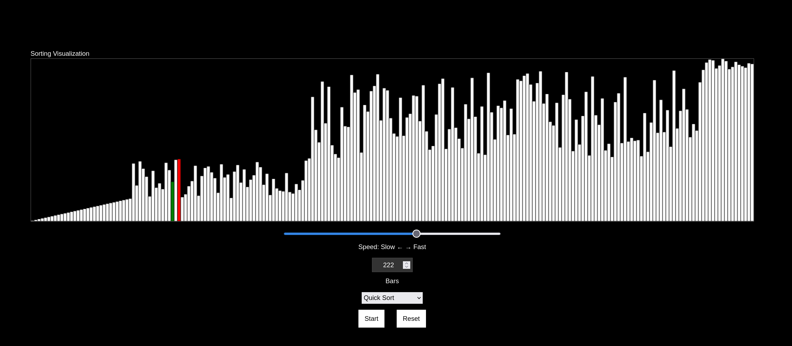

# Sorting Algorithm Visualizer

A visual tool for exploring and understanding sorting algorithms built with Next.js.



## 🚀 Features

- Interactive visualization of popular sorting algorithms
- Adjustable array size and sorting speed
- Real-time visualization of array manipulations
- Dynamic audio feedback generated on-the-fly using Web Audio API
- Clean, modern UI built with Next.js and Tailwind CSS

## 🧮 Supported Algorithms

- Bubble Sort
- Selection Sort
- Insertion Sort
- Merge Sort
- Quick Sort
- Heap Sort

## 🛠️ Built With

- [Next.js](https://nextjs.org/) - React framework
- TypeScript
- Tailwind CSS
- Web Audio API for dynamic sound generation
- [Geist](https://vercel.com/font) font from Vercel

## 🚦 Getting Started

### Prerequisites

- Node.js (v18 or higher)
- npm, yarn, pnpm, or bun

### Installation

1. Clone the repository

```bash
git clone https://github.com/henzogomes/sorting-visualizer.git
cd sorting-visualizer
```

2. Install dependencies

```bash
npm install
# or
yarn install
# or
pnpm install
# or
bun install
```

3. Start the development server

```bash
npm run dev
# or
yarn dev
# or
pnpm dev
# or
bun dev
```

4. Open [http://localhost:3000](http://localhost:3000) to view the app in your browser

## 🧩 How to Use

1. Select an algorithm from the available options
2. Adjust the array size and sorting speed using the controls
3. Click "Reset" to create a random array
4. Click "Sort" to start the visualization
5. Listen to the generated audio tones that correspond to bar heights

## 🔊 Audio Visualization

This project uses the Web Audio API to generate audio feedback in real-time as the sorting algorithms run:

- Each bar height corresponds to a specific frequency tone
- The audio is synthesized on-the-fly using oscillators - no pre-recorded audio files
- Triangle wave oscillators create a pleasant tone that varies with array element values
- Audio provides an additional sensory dimension to understand how sorting algorithms work

## 👤 Author

Your Name - [@henzogomes](https://github.com/henzogomes)
